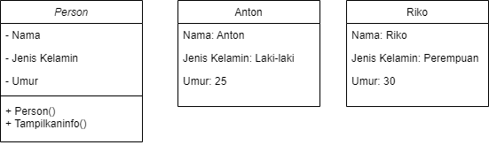
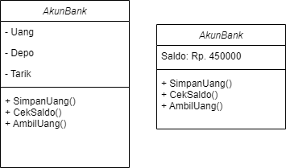
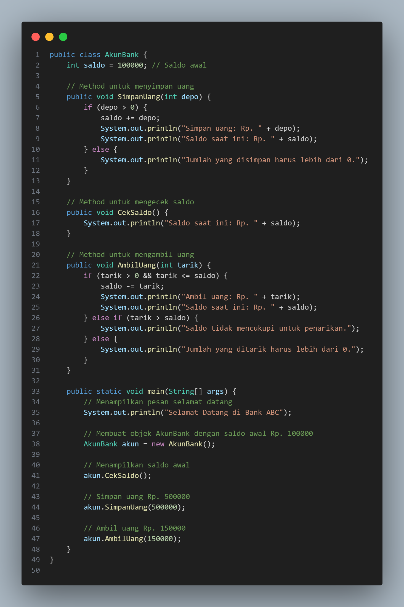
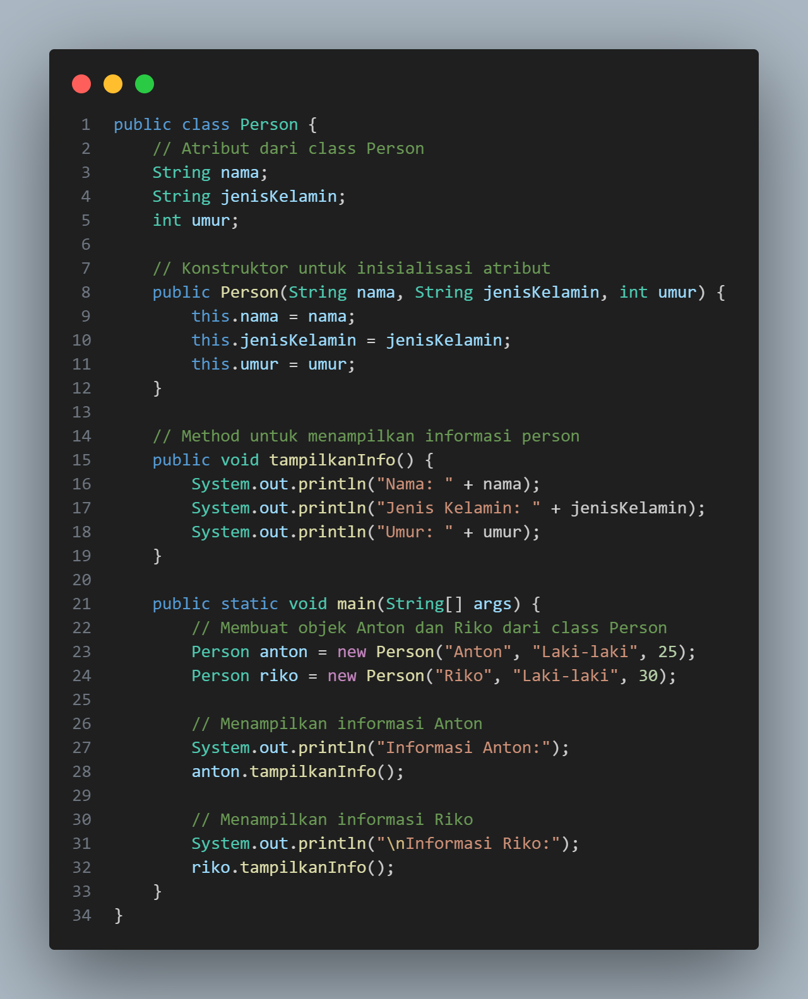
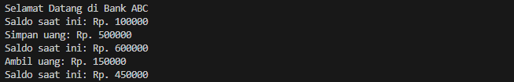
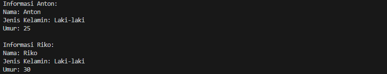

# Pertemuan3_Class_dan_Object

## Profil
| Variable | Isi |
| -------- | --- |
| **Nama** | Intan Virginia Aulia Putri |
| **NIM** | 312310657 |
| **Kelas** | TI.23.A.6 |
| **Mata Kuliah** | Pemrograman Orientasi Objek |

### Latihan 1
- Apa yang harus didefinisikan sebelum membuat objek?
1. Class (Kelas): Ini adalah template atau cetakan dari objek. Misalnya, dalam diagram pertama, Anda punya kelas **AkunBank**, dan dalam diagram kedua, Anda punya kelas **Person**.
2. Atribut: Variabel yang menyimpan data untuk setiap objek yang dibuat. Sebagai contoh, untuk **AkunBank**, atribut-atributnya adalah `Saldo`, sedangkan untuk **Person**, atribut-atributnya adalah `Nama`, `Jenis Kelamin`, dan `Umur`.
3. Metode (Fungsi): Ini adalah perilaku yang dapat dilakukan oleh objek. Misalnya, pada **AkunBank**, metode yang didefinisikan adalah `SimpanUang()`, `CekSaldo()`, dan `AmbilUang()`. Pada **Person**, ada metode `TampilkanInfo()`.
- Buatlah gambar diagram class dan dua buah objek dari class Person bernama Antor dan Riko

- Buatlah gambar diagram objek AkunBank dengan instance method simpanUang, ambilUang dan cekSaldo

### Latihan 2
Buatlah kode program java untuk:
- Mendeklarasikan class Person, dengan atribut Nama, JenisKelamin, Umur
- Buatlah dua buah objek dari class Person bernama Anton dan Riko

### Latihan 3
Buatlah kode java untuk:
- Mendeklarasikan class AkunBank dengan instance method simpanUang, ambilUang dan cekSaldo
- Buat objek AkunBank dan tetapkan nilai saldo awal Rp. 100000, kemudian panggil 3 method tersebut dan tampilkan proses berikut:
Selamat Datang di Bank ABC 
Saldo saat ini: Rp. 100000 
Simpan uang: Rp. 500000 
Saldo saat ini: Rp. 600000 
Ambil uang: Rp. 150000 
Saldo saat ini: Rp. 450000

